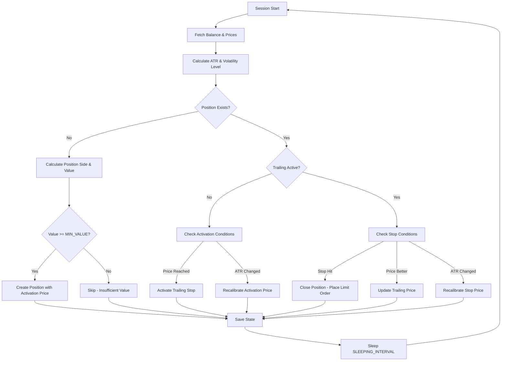
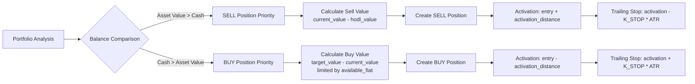

# BoTCoin - Autonomous Digital Asset Manager

> **Autonomous Trading System with Real-Time Market Analysis and Adaptive Volatility Management**

BoTCoin is a sophisticated, 24/7 autonomous digital asset management system that analyzes market conditions in real-time and dynamically adapts trading behavior based on measured volatility. The system integrates with Kraken exchange and provides real-time monitoring and alerts through Telegram.

## 🎯 System Overview

BoTCoin operates as an autonomous trading agent that:

- **Analyzes Market State**: Continuously monitors market conditions using technical indicators (ATR - Average True Range)
- **Adaptive Behavior**: Dynamically adjusts trading parameters based on current volatility levels
- **Balance-Based Decision Logic**: Prioritizes operations based on portfolio composition (asset vs. cash predominance)
- **Risk Management**: Implements trailing stop mechanisms with volatility-adjusted distances
- **Real-Time Monitoring**: Telegram integration for commands, alerts, and position tracking

### Key Features

- 🔄 **24/7 Autonomous Operation** on Google Cloud Platform (Free Tier VPS)
- 📊 **Real-Time Market Analysis** using Pandas DataFrames and Numpy vectorized calculations
- 🎚️ **5-Level Volatility Classification** (LL, LV, MV, HV, HH) based on ATR percentiles
- 📱 **Telegram Bot Interface** for monitoring and control
- 🔐 **Secure Configuration** via environment variables
- 🚀 **Automated CI/CD** deployment through GitHub Actions
- 💾 **Data Persistence** with CSV-based data sinks for audit and analysis

## 🏗️ Architecture & Trading Engine

### Core Trading Logic

The system implements a **balance-majority decision logic**:

1. **Position Creation** (`create_position`):
   - Analyzes portfolio balance between asset and cash
   - If **asset predominates** → prioritizes **SELL** positions
   - If **cash predominates** → prioritizes **BUY** positions
   - Calculates activation price based on K_ACT (activation coefficient) or K_STOP + MIN_MARGIN

2. **Position Management** (`update_trailing_state`):
   - **Pre-Activation Phase**: Monitors activation price and recalibrates if ATR changes significantly
   - **Post-Activation Phase**: Implements trailing stop mechanism
   - **Dynamic Recalibration**: Adjusts stop distances when ATR deviates beyond ±20% (`ATR_DESV_LIMIT`)

3. **Position Closure** (`close_position`):
   - Executes limit orders when stop price is hit
   - Calculates and logs P&L (Profit/Loss percentage)
   - Persists closed position data for historical analysis

### Trading Flow



### Decision Logic Diagram



**Activation Distance Calculation**:
```python
if k_act is not None:
    # Use K_ACT if defined
    activation_distance = float(k_act) * atr_val
else:
    # Use K_STOP and MIN_MARGIN if K_ACT is not defined
    activation_distance = k_stop * atr_val + min_margin * entry_price
```

## 📊 Data Analysis & Volatility Regimes

### Market Data Processing

The system uses Pandas DataFrames for efficient market data manipulation and Numpy for vectorized statistical calculations:

- **OHLC Data Ingestion**: Fetches candlestick data from Kraken via `fetch_ohlc_data`
- **ATR Calculation**: Rolling window calculation using True Range components (H-L, H-PC, L-PC)
- **Historical Persistence**: Stores market data in CSV files (`data/{pair}_ohlc_data_{timeframe}min.csv`)
- **Incremental Updates**: Appends only new candles to existing datasets

### Volatility Classification

The system classifies market conditions into **5 volatility levels** based on ATR percentiles:

| Level | Range | Description |
|-------|-------|-------------|
| **LL** | < P20 | Very Low Volatility |
| **LV** | P20-P50 | Low Volatility |
| **MV** | P50-P80 | Medium Volatility |
| **HV** | P80-P95 | High Volatility |
| **HH** | > P95 | Very High Volatility |

**Implementation** (`get_volatility_level`):

```python
def get_volatility_level(pair, atr_val):
    if atr_val < PAIRS[pair]["atr_20pct"]:
        return "LL"
    elif atr_val < PAIRS[pair]["atr_50pct"]:
        return "LV"
    elif atr_val < PAIRS[pair]["atr_80pct"]:
        return "MV"
    elif atr_val < PAIRS[pair]["atr_95pct"]:
        return "HV"
    return "HH"
```

### Structural Noise Analysis

The `analyze_structural_noise` function identifies market pivot points and calculates maximum drawdown/bounce (K values) for each volatility level:

- **Pivot Detection**: Uses `scipy.signal.argrelextrema` to identify local minima and maxima
- **Trend Segmentation**: Separates uptrends (min→max) and downtrends (max→min)
- **K-Value Calculation**: For each volatility segment, computes `K = max_deviation / ATR`
- **Statistical Distribution**: Provides percentile-based K_STOP recommendations (P50, P75, P90, P95, P100)

## 💾 Persistence & Data Structure

### State Management

**Active Positions** (`data/trailing_state.json`):
```json
{
  "XBTEUR": {
    "side": "sell",
    "volume": 0.00123456,
    "entry_price": 45000.0,
    "activation_atr": 1250.0,
    "activation_price": 47500.0,
    "activation_time": "2026-02-03 10:30:15",
    "trailing_price": 48200.0,
    "stop_price": 46950.0,
    "stop_atr": 1250.0,
    "creation_time": "2026-02-03 08:15:00"
  }
}
```

**Closed Positions** (`data/closed_positions.json`):
```json
{
  "XBTEUR": [
    {
      "side": "sell",
      "volume": 0.00123456,
      "entry_price": 45000.0,
      "activation_atr": 1250.0,
      "activation_price": 47500.0,
      "creation_time": "2026-02-03 08:15:00",
      "activation_time": "2026-02-03 10:30:15",
      "trailing_price": 48200.0,
      "stop_price": 46950.0,
      "stop_atr": 1250.0,
      "closing_price": 46950.0,
      "closing_order": "OXY7KL-XXXXX-XXXXXX",
      "closing_time": "2026-02-03 12:45:30",
      "pnl": 4.33
    }
  ]
}
```

### Data Sink Architecture

The system uses **CSV files as data sinks** for:

- **Market Data**: Historical OHLC and ATR calculations
- **Audit Trail**: Immutable record of all closed positions
- **Performance Analysis**: Enable post-operation backtesting and optimization

## 🔌 Exchange Integration

### Kraken API

**Current Scope**: EUR-based trading pairs only (supports multiple pairs simultaneously)

**Key Functions** (`exchange/kraken.py`):
- `get_balance()`: Retrieves account balances
- `get_last_prices(pairs)`: Fetches current market prices for all configured pairs
- `fetch_ohlc_data(pair, interval, since)`: Downloads historical candlestick data
- `place_limit_order(pair, side, price, volume)`: Executes limit orders
- `get_order_status(order_id)`: Checks order execution status

**Modular Design**: The architecture supports future expansion to:
- Other exchanges (Binance, Coinbase, etc.)
- Additional fiat currencies (USD, GBP, etc.)

## 📱 Telegram Integration

### Command Interface

The bot provides real-time interaction through Telegram commands:

| Command | Description |
|---------|-------------|
| `/help` | Display available commands and configured pairs |
| `/status` | Show bot operational status (RUNNING/PAUSED) |
| `/pause` | Pause trading operations (safe mode) |
| `/resume` | Resume trading operations |
| `/market [pair]` | Display current market data and balances |
| `/positions [pair]` | Show open positions with P&L estimates |

**Example**: Telegram interface in action


### Automated Alerts

The system sends real-time notifications for:
- ✅ Bot startup and configuration
- 🆕 New position creation
- ⚡ Position activation (trailing start)
- 💸 Position closure with P&L
- ⚠️ System errors and warnings

**Implementation**: Thread-safe communication between main trading loop and Telegram handler using `core.runtime` shared state.

## 🧪 Simulation & Optimization

### Backtest Module

**Purpose**: Validate trading strategies against historical data

**Key Features** (`trading/backtest.py`):
- Simulates full trading cycles with configurable parameters
- Accounts for exchange fees and slippage
- Calculates performance metrics (total return, number of operations, win rate)
- Supports date range filtering and operation limits

**Usage**:
```bash
python trading/backtest.py PAIR=XBTEUR FEE_PCT=0.26 START=2025-01-01 END=2026-01-01 MAX_OPS=50
```

### Optimizer Module

**Purpose**: Find optimal trading parameters through grid search

**Key Features** (`trading/optimize_params.py`):
- Exhaustive parameter combinations testing
- Multiple optimization modes: CONSERVATIVE, AGGRESSIVE, CURRENT
- Train/test split for validation
- Ranking methods: ROBUST (median + IQR) or MEAN (average)
- Configurable search space for K_ACT, K_STOP percentiles, and MIN_MARGIN

**Usage**:
```bash
python trading/optimize_params.py PAIR=XBTEUR MODE=CONSERVATIVE FEE_PCT=0.26 TRAIN_SPLIT=0.7
```

### ⚠️ Transparency Note

The **Backtest and Optimizer modules** have been developed with intensive AI assistance to accelerate prototyping and parameter optimization. While the core trading logic is manually designed and validated, these analytical components benefit from automated code generation for statistical calculations and performance evaluation.

## ⚙️ Configuration & Deployment

### Environment Variables

**Credentials**:
```bash
KRAKEN_API_KEY=your_api_key
KRAKEN_API_SECRET=your_api_secret
TELEGRAM_TOKEN=your_bot_token
TELEGRAM_USER_ID=your_telegram_id
```

**System Settings**:
```bash
SLEEPING_INTERVAL=60           # Seconds between sessions
PARAM_SESSIONS=720             # Recalculate parameters every N sessions (12h)
CANDLE_TIMEFRAME=15            # Candle size in minutes
MARKET_DATA_DAYS=60            # Historical data window
ATR_PERIOD=14                  # ATR calculation period
ATR_DESV_LIMIT=0.2            # Recalibration threshold (20%)
MIN_VALUE=10                   # Minimum operation value (EUR)
TELEGRAM_POLL_INTERVAL=0       # Telegram polling interval in seconds (0 = default)
MINIMUM_CHANGE_PCT=0.02        # Minimum price change for pivot detection (2%)
```

**Trading Pairs**:
```bash
PAIRS=XBTEUR,ETHEUR            # Comma-separated list
```

**Asset Allocation** (per pair):
```bash
XBTEUR_TARGET_PCT=50           # Target portfolio percentage
XBTEUR_HODL_PCT=20             # Minimum hold percentage (don't sell below)
```

**Trading Parameters** (per pair and side):

Configuration can be done in two ways:

1. **Common for both sides** (simpler):
```bash
XBTEUR_K_ACT=2.0               # Activation coefficient for both BUY and SELL
XBTEUR_MIN_MARGIN=0.006        # Minimum margin for both BUY and SELL (0.6%)
```

2. **Independent per side** (more control):
```bash
XBTEUR_SELL_K_ACT=2.0          # Sell activation coefficient (multiplies ATR)
XBTEUR_SELL_MIN_MARGIN=0.006   # Minimum profit margin for SELL (0.6%)
XBTEUR_BUY_K_ACT=1.5           # Buy activation coefficient
XBTEUR_BUY_MIN_MARGIN=0.003    # Minimum profit margin for BUY (0.3%)
```

**Stop Loss Configuration** (per volatility level):
```bash
XBTEUR_STOP_PCT_LL=0.90        # 90th percentile for Very Low Volatility
XBTEUR_STOP_PCT_LV=0.90        # 90th percentile for Low Volatility
XBTEUR_STOP_PCT_MV=0.90        # 90th percentile for Medium Volatility
XBTEUR_STOP_PCT_HV=0.90        # 90th percentile for High Volatility
XBTEUR_STOP_PCT_HH=0.90        # 90th percentile for Very High Volatility
```

### Infrastructure

**Cloud Deployment**: Google Cloud Platform Free Tier VPS
- **Availability**: 24/7 operation
- **Reliability**: Automatic restart on failure
- **Cost**: Zero infrastructure cost

**CI/CD Pipeline** (`.github/workflows/deploy.yml`):

```yaml
name: Deploy BoTC

on:
  push:
    branches:
      - main

jobs:
  deploy:
    runs-on: ubuntu-latest
    steps:
    - name: Checkout repository
      uses: actions/checkout@v3
    
    - name: Execute remote deploy script via SSH
      uses: appleboy/ssh-action@029f5b4aeeeb58fdfe1410a5d31a6cfbfdb0133d  # v0.1.8
      with:
        host: ${{ secrets.VM_IP }}
        username: ${{ secrets.VM_USER }}
        key: ${{ secrets.VM_KEY }}
        script: "bash ~/deploy_BoTC.sh"
```

**Deployment Flow**:
1. Push code to `main` branch
2. GitHub Actions triggers deployment workflow
3. SSH connection to production VPS
4. Remote script pulls latest code
5. Service restart with zero downtime

### Configuration Validation & Logging

The system performs comprehensive validation on startup and provides detailed logging throughout operation:

**Startup Validation**:
```
[INFO] ============================================================
[INFO] ✅ CONFIGURATION VALIDATED SUCCESSFULLY
[INFO] ============================================================
[INFO] Telegram polling interval: 10s
[INFO] Session interval: 60s
[INFO] Parameter calculation sessions: 720
[INFO] Candle timeframe: 15min
[INFO] Market data storage: 120 days
[INFO] ATR period: 14 candles
[INFO] Pairs to trade: XBTEUR, ETHEUR
[INFO] ------------------------------------------------------------
```

**Session Logs**: Each trading session provides detailed information:
```
[INFO] ======== STARTING SESSION ========
[INFO] --- Processing pair: [XBTEUR] ---
[INFO] Calculating trading parameters...
[INFO] ATR percentiles → P20:100.0€ | P50:174.2€ | P80:291.9€ | P95:462.5€
[INFO] K_STOP_SELL → LL:2.90 | LV:3.30 | MV:4.30 | HV:1.60 | HH:1.40
[INFO] K_STOP_BUY  → LL:4.20 | LV:3.10 | MV:4.60 | HV:2.00 | HH:1.30
[INFO] Market: 66,381.2€ | ATR: 190.0€ (MV)
[INFO] --- Processing pair: [ETHEUR] ---
[INFO] Calculating trading parameters...
[INFO] ATR percentiles → P20:4.8€ | P50:8.0€ | P80:13.5€ | P95:21.7€
[INFO] K_STOP_SELL → LL:10.60 | LV:3.80 | MV:6.10 | HV:5.50 | HH:2.30
[INFO] K_STOP_BUY  → LL:11.40 | LV:2.60 | MV:6.50 | HV:6.80 | HH:3.20
[INFO] Market: 1,948.7€ | ATR: 10.2€ (MV)
[INFO] Session complete. Sleeping for 60s.

[INFO] ======== STARTING SESSION ========
[INFO] --- Processing pair: [XBTEUR] ---
[INFO] Market: 66,429.4€ | ATR: 191.1€ (MV)
[INFO] --- Processing pair: [ETHEUR] ---
[INFO] Market: 1,952.1€ | ATR: 10.4€ (MV)
[INFO] Session complete. Sleeping for 60s.
```

All logs include timestamps and are organized by:
- **Configuration validation**: System settings and pair configuration
- **Parameter calculation**: ATR percentiles and K_STOP values per volatility level
- **Market state**: Current price, ATR, and volatility classification
- **Position events**: Creation, activation, recalibration, and closure

## 🚀 Quick Start

### Prerequisites

```bash
pip install -r requirements.txt
```

**Dependencies**:
- `pandas` & `numpy`: Data analysis and vectorized calculations
- `scipy`: Statistical signal processing for pivot detection
- `krakenex`: Kraken exchange integration
- `python-telegram-bot`: Telegram bot interface
- `python-dotenv`: Environment configuration management

### Local Execution

1. **Configure Environment**:
   
   Create a `.env` file in the project root with the following variables:
   
```bash
# Kraken API Credentials
KRAKEN_API_KEY=your_api_key
KRAKEN_API_SECRET=your_api_secret

# Telegram Bot Credentials (obtain from @BotFather)
TELEGRAM_TOKEN=your_bot_token              # Bot token from @BotFather
TELEGRAM_USER_ID=your_telegram_id          # Your numeric Telegram user ID

# System Settings
SLEEPING_INTERVAL=60
PARAM_SESSIONS=720
CANDLE_TIMEFRAME=15
MARKET_DATA_DAYS=60
ATR_PERIOD=14
ATR_DESV_LIMIT=0.2
MIN_VALUE=10
TELEGRAM_POLL_INTERVAL=0                   # 0 = default polling, >0 = custom interval in seconds
MINIMUM_CHANGE_PCT=0.02                    # Minimum 2% price change for pivot detection

# Trading Pairs
PAIRS=XBTEUR,ETHEUR

# Asset Allocation (per pair)
XBTEUR_TARGET_PCT=50
XBTEUR_HODL_PCT=20
ETHEUR_TARGET_PCT=30
ETHEUR_HODL_PCT=15

# Trading Parameters (example)
XBTEUR_K_ACT=2.0
XBTEUR_MIN_MARGIN=0.006
XBTEUR_STOP_PCT_LL=0.90
XBTEUR_STOP_PCT_LV=0.90
XBTEUR_STOP_PCT_MV=0.90
XBTEUR_STOP_PCT_HV=0.90
XBTEUR_STOP_PCT_HH=0.90
```

2. **Initialize Data**:
```bash
python -c "from core.state import *; import os; os.makedirs('data', exist_ok=True)"
```

3. **Run Bot**:
```bash
python main.py
```

### Analysis Tools

**Market Structure Analysis**:
```bash
python trading/market_analyzer.py PAIR=XBTEUR Volatility=ALL SHOW_EVENTS
```

**Parameter Optimization**:
```bash
python trading/optimize_params.py PAIR=XBTEUR MODE=CONSERVATIVE FEE_PCT=0.26
```

**Backtest Strategy**:
```bash
python trading/backtest.py PAIR=XBTEUR FEE_PCT=0.26
```

## 📈 Project Structure

```
BoTCoin/
├── main.py                      # Application entry point
├── requirements.txt             # Python dependencies
├── .env                         # Configuration (not in repo)
│
├── core/
│   ├── config.py               # Configuration loader
│   ├── runtime.py              # Thread-safe shared state
│   ├── state.py                # Position persistence
│   ├── logging.py              # Logging utilities
│   ├── utils.py                # Common utilities
│   └── validation.py           # Configuration validation
│
├── exchange/
│   └── kraken.py               # Kraken API integration
│
├── services/
│   └── telegram.py             # Telegram bot interface
│
├── trading/
│   ├── inventory_manager.py   # Portfolio calculation logic
│   ├── market_analyzer.py     # ATR and structural analysis
│   ├── parameters_manager.py  # Dynamic parameter calculation
│   ├── positions_manager.py   # Position lifecycle management
│   ├── backtest.py            # Historical simulation
│   └── optimize_params.py     # Parameter optimization
│
├── data/                        # Runtime data (CSV + JSON)
│   ├── trailing_state.json     # Active positions
│   ├── closed_positions.json   # Historical operations
│   └── *_ohlc_data_*.csv      # Market data cache
│
└── .github/
    └── workflows/
        └── deploy.yml          # CI/CD automation
```

## 🔒 Security Considerations

- **API Keys**: Never commit credentials; use environment variables exclusively
- **Authentication**: Telegram bot validates user ID before executing commands
- **Order Validation**: All operations require minimum value threshold
- **Rate Limiting**: Respects exchange API limits with sleep intervals
- **Error Handling**: Graceful degradation with notification on failures

## 📊 Performance Metrics

The system tracks and logs:
- **Position Metrics**: Entry/exit prices, ATR at decision points, P&L percentage
- **Market Metrics**: Volatility distribution, ATR percentiles, price movements
- **Operational Metrics**: Session count, position refresh cycles, recalibration events

All data persists in CSV format for:
- Historical performance analysis
- Strategy backtesting
- Parameter optimization
- Audit compliance

## 🛠️ Technical Highlights

### Core Technologies
- **Python 3.x**: Main programming language
- **Pandas & Numpy**: High-performance data analysis
- **Scipy**: Advanced statistical calculations
- **AsyncIO**: Asynchronous Telegram bot integration
- **Threading**: Concurrent operation (trading loop + bot interface)

### Design Patterns
- **Modular Architecture**: Separation of concerns (trading, exchange, services)
- **Configuration as Code**: Environment-driven behavior
- **State Persistence**: JSON for active state, CSV for historical audit
- **Thread-Safe State**: Locking mechanism for concurrent access

### Key Algorithms
- **ATR-Based Volatility**: Dynamic stop distances using True Range
- **Pivot Detection**: Local extrema identification with scipy
- **Trailing Stop**: Price-following mechanism with volatility adaptation
- **Balance-Majority Logic**: Portfolio-driven decision making

## 📝 License & Disclaimer

This project is for educational and portfolio demonstration purposes. 

**⚠️ Trading Disclaimer**: Cryptocurrency trading involves substantial risk. This bot operates with real funds and can result in financial loss. Use at your own risk. Past performance does not guarantee future results.

---

**Author**: [jAjiz](https://github.com/jAjiz)  
**Repository**: [BoTCoin](https://github.com/jAjiz/BoTCoin)

---

*Built with data-driven decision making and continuous operation in mind.*
